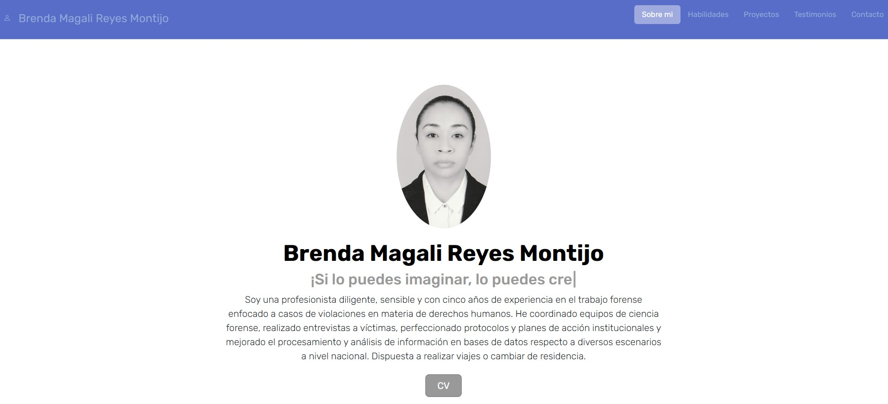
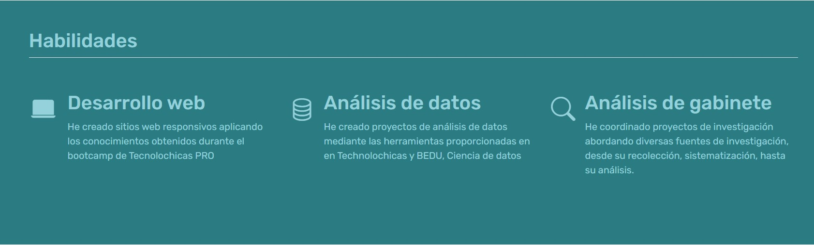

## Portafolio de proyectos

¡Hola! Soy ***Brenda Reyes***, cientifica forense, desarrolladora web Jr., apasionada por el tema de análisis de datos y búsqueda de personas.💻🛢🔎💖👩👨‍🦳👲

______________
### El proyecto cuenta con las secciones de: 
- 🦾 Habilidades 
- 📑 Proyectos 
- 🗣 Testimonios 
- 🔔 Contacto 
_______________________
### Creado con:
- HTML
- CSS
- JavaScript

    
    <a href="https://developer.mozilla.org/en-US/docs/Web/JavaScript" target="_blank">  </a>
    
________________________
### Vista Previa

__________________________
### ***Espero pronto saber de ti!***
*Correo*
[magalireyes97@gmail.com](mailto:magalireyes97@gmail.com)
__________________________
### Creado en el bootcamp de TecnolochicasPro💜🖤💜
[Tecnolochicas](https://tecnolochicas.mx/)